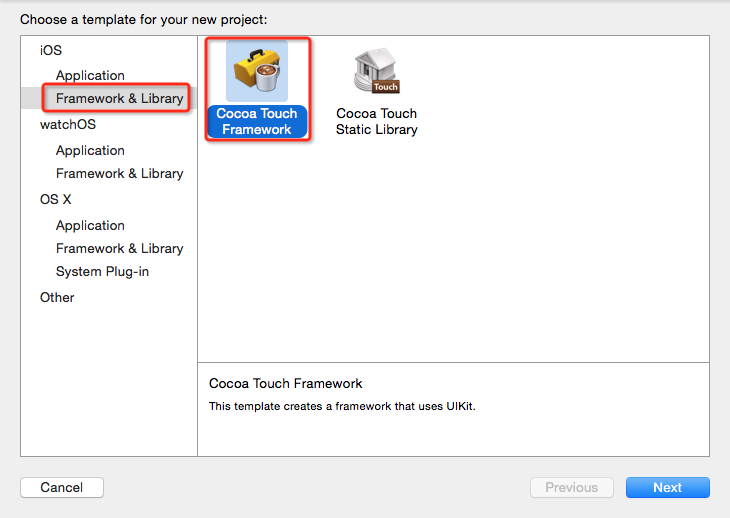
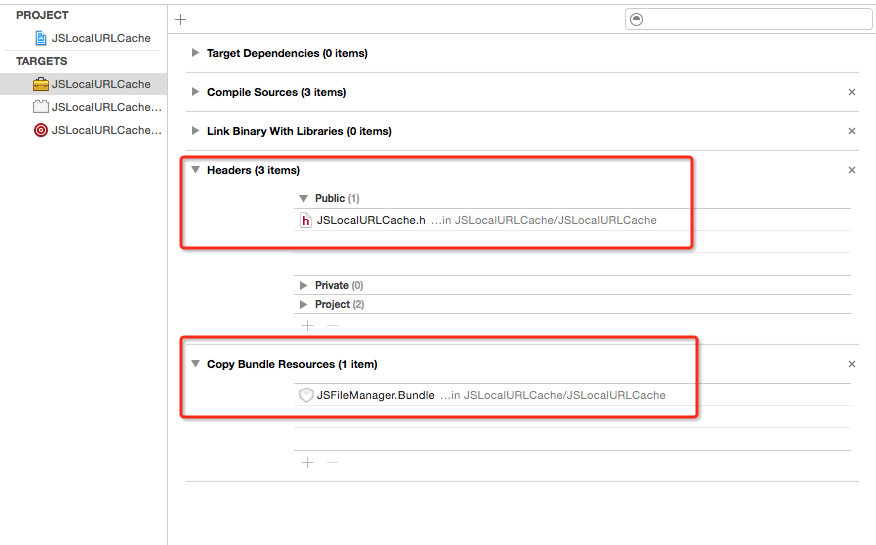
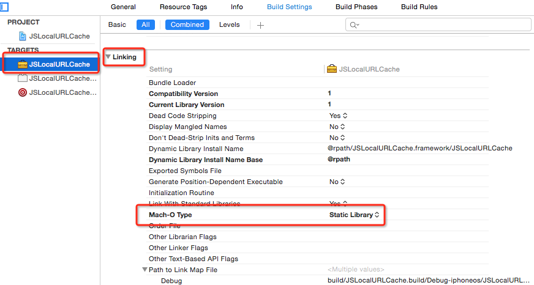
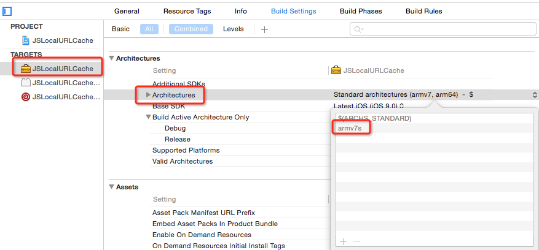
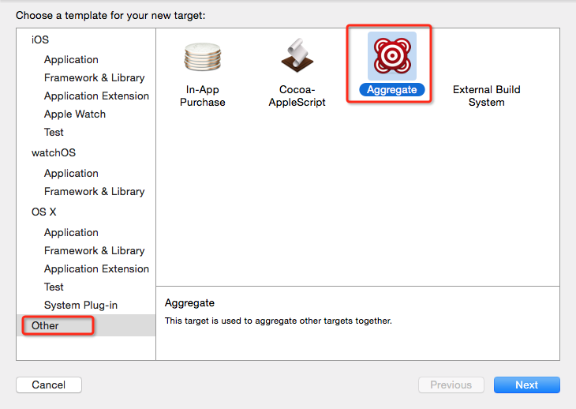
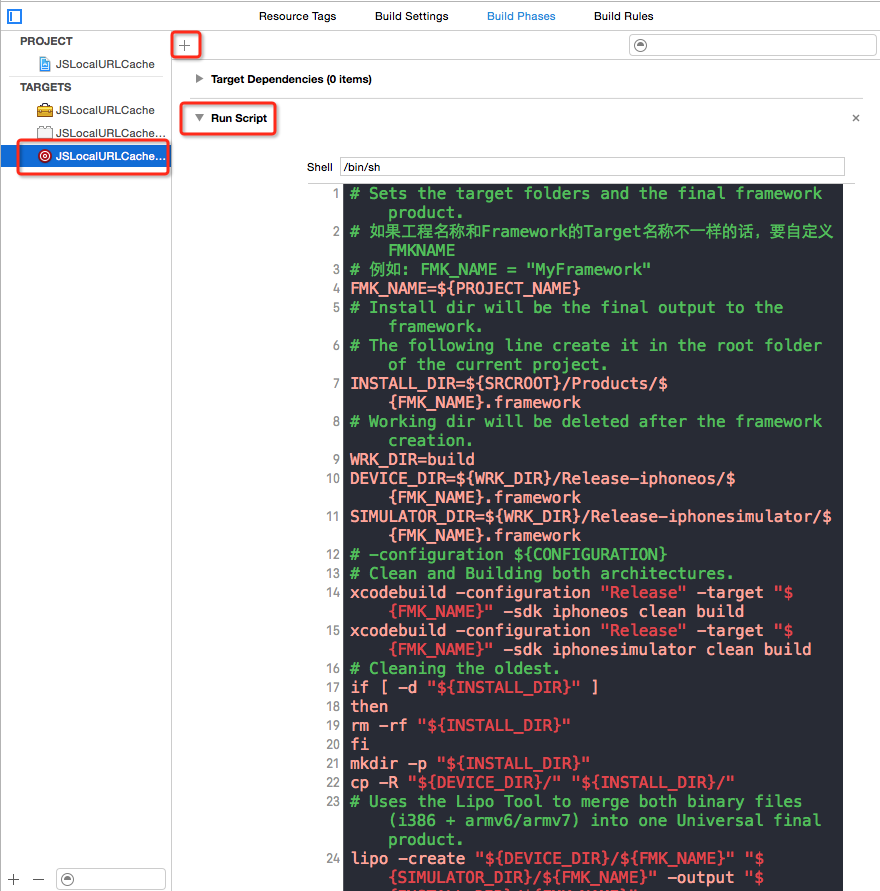

# Framework

新建工程并选择默认Target为Cocoa Touch Framework

设置对外可见的头文件以及资源文件

如果需要编译成静态的，则需要做如下更改

因为默认编译方式为 arm64、armv7，需要添加 armv7s，如下

编码完成之后，直接Run就能成功生成Framework文件了，选择 xCode->Window->Organizer->Projects->Your Project, 打开工程的Derived Data目录，这样就能找到生成的Framework文件了

但是这种Framework只能模拟器或者真机单独使用，无法通用

##### 制作通用动态库

新建Aggregate Target

添加script到新建的Target

具体内容如下：

	# Sets the target folders and the final framework product.
	# 如果工程名称和Framework的Target名称不一样的话，要自定义FMKNAME
	# 例如: FMK_NAME = "MyFramework"
	FMK_NAME=${PROJECT_NAME}
	# Install dir will be the final output to the framework.
	# The following line create it in the root folder of the current project.
	INSTALL_DIR=${SRCROOT}/Products/${FMK_NAME}.framework
	# Working dir will be deleted after the framework creation.
	WRK_DIR=build
	DEVICE_DIR=${WRK_DIR}/Release-iphoneos/${FMK_NAME}.framework
	SIMULATOR_DIR=${WRK_DIR}/Release-iphonesimulator/${FMK_NAME}.framework
	# -configuration ${CONFIGURATION}
	# Clean and Building both architectures.
	xcodebuild -configuration "Release" -target "${FMK_NAME}" -sdk iphoneos clean build
	xcodebuild -configuration "Release" -target "${FMK_NAME}" -sdk iphonesimulator clean build
	# Cleaning the oldest.
	if [ -d "${INSTALL_DIR}" ]
	then
		rm -rf "${INSTALL_DIR}"
	fi
	mkdir -p "${INSTALL_DIR}"
	cp -R "${DEVICE_DIR}/" "${INSTALL_DIR}/"
	# Uses the Lipo Tool to merge both binary files (i386 + armv6/armv7) into one Universal final product.
	lipo -create "${DEVICE_DIR}/${FMK_NAME}" "${SIMULATOR_DIR}/${FMK_NAME}" -output "${INSTALL_DIR}/${FMK_NAME}"
	rm -r "${WRK_DIR}"
	open "${INSTALL_DIR}"

选中新建的Target，Run, 如果没有异常的话，会自动弹出生成的Framework文件

这样生成的动态库就能同时支持模拟器和真机了